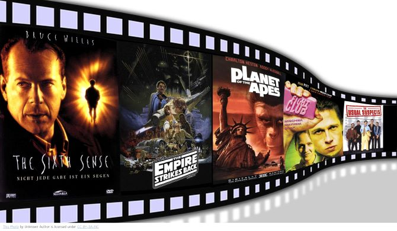

# Microsoft Movie Analysis 
**Author: [Carla Kirby](mailto:ra_carlajoy@yahoo.com)

## Overview 

This project analyzes the resource needs of the [Microsoft Movie Analysis Project]. The data contained in this analysis has been sourced from IMDb's website. IMDb is a credible movie streaming service which obtains extreme amounts of metadata. From the zipped CSV data files I have chosen to select (2) datasets containing critical details necessary to complete an accurate analysis in efforts to solve the business problem. The information contained relates directly to genres, total domestic gross at time of release and spans across an 8 year period.

## Business Problem

Microsoft sees all the big companies creating original video content and they want to get in on the fun. They have decided to create a new movie studio, but they don’t know anything about creating movies. You are charged with exploring what types of films are currently doing the best at the box office. THis report will translate those findings into actionable insight for the head of Microsoft's new movie studio can use to help decide what type of films to create. 

## Data

A few of the variables included are movie titles, year of release, domestic gross totals, foreign gross totals, run time minutes, ID's, and the studio who produced the films. The target variable I have chosen is domestic gross value and genre. It is necessary to advise the head of Microsoft Studios the highest box office gross values in conjunction with the associated types of films to clearly indicate what the national favourites are. 

## Methods

This project uses descriptive analysis, comparing domestic gross values against popular genres. We also take a deeper dive intounderstand what Studio is producing these films and how the trends have performed over a span of time. 

## Visualization 

## Results 

We are able to observe that the most popular genres at the box office are: Action, Adventure and Sci-Fi films. In addition Marvel Studios are the studio who produced 7 of the 10 Top domestically grossing films from our results. 

## Conclusions 

Although there are many more dramas and documentaries listed, the highest grossing domestic amounts are Adventure, Action and Sci-Fi films.

This analysis leads to three recommendations to helping Microsoft understand what genres are performing best. 
    - Action Films: These films are grossing at number 1 as being the most popular and frequently paid for and visited films
    - Adventure Films: In a close second, Adventure films usually couple with the action genre and will produce high domestic gross. 
    - Sci-Fi:Sci-Fi movies will be a great choice of genre aswell. 
    

 ## Next Steps
 
Blending genres will be more interesting and encourage movie goers to watch in the box office. 
 
Finally, BV - Marvel Studios (aka Walt Disney aka Buena Vista Studios) definately know how to create box office hits. 

Microsoft should conduct in depth research into BV's success method and how they formulate their movies which is indicative of series style films. 

## For More Information 

Please review our full analysis in the Jupyter Notebook[Jupyter Notebook] (./MicrosoftMovieAnalysisProject.ipynb) or our [presentation](./presentation.pdf).

For more information contact **Carla Kirby, ra_carlajoy@yahoo.com** 
  
